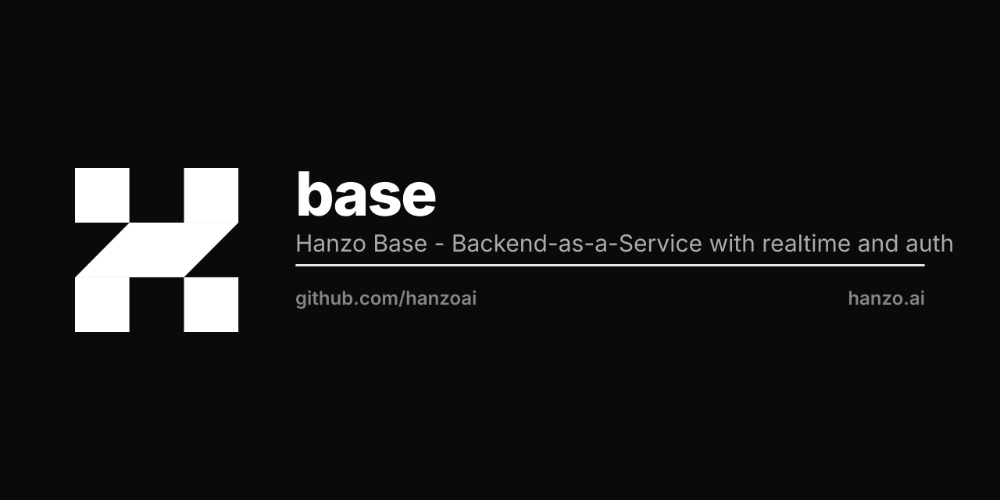

<p align="center"></p>

# Base

The embedded, **SQLite-first** application backend for the Hanzo cloud — per-tenant data, in-process extension runtimes, and Hanzo IAM built in. One Go binary; the storage substrate every multi-tenant Hanzo Go service builds on.

[]()
[]()

## Quick start

```bash
go install github.com/hanzoai/base/examples/base@latest
base serve
```

Then open the admin dashboard at `http://127.0.0.1:8090/_/`.

> [!NOTE]
> Base is under active development. Full backward compatibility is not guaranteed before `v1.0.0`.

## What this is

[Base](https://hanzo.ai/base) is an open source Go backend that gives every Hanzo Go service the same multi-tenant substrate. It includes:

- embedded **in-memory, SQL, and vector** data with **realtime subscriptions**
- built-in **files and users management**
- a convenient **Admin dashboard UI**
- **GraphQL** and a REST-style **`/v1` API**
- native **analytics and AI observability**
- **Hanzo IAM** as the one and only auth path (OIDC / PKCE)
- deep integration with the **[Hanzo AI Cloud](https://hanzo.ai)** for scale on day one

Each org gets its own per-tenant data file with a per-org KMS-derived DEK; `replicate` streams the WAL to age-encrypted object storage. Per-record validators, computed fields, and access rules run inside the same process via in-process extension runtimes (goja, wazero, pyvm, starkvm).

Use **[Hanzo App](https://hanzo.app)** to rapidly iterate and build new apps.

## API clients

The easiest way to talk to the Base web API is one of the official SDK clients:

- **JavaScript — [@hanzoai/js-sdk](https://github.com/hanzoai/js-sdk)** (_Browser, Node.js, React Native_)
- **Dart — [@hanzoai/dart-sdk](https://github.com/hanzoai/dart-sdk)** (_Web, Mobile, Desktop, CLI_)

See the full guide at [docs.hanzo.ai](https://docs.hanzo.ai).

## Overview

### Use as a standalone app

Download the prebuilt executable for your platform from the [Releases page](https://github.com/hanzoai/base/releases), extract the archive, and run `./base serve`.

The prebuilt executables are built from [`examples/base/main.go`](https://github.com/hanzoai/base/blob/main/examples/base/main.go) and ship with a JavaScript plugin enabled by default, so you can extend Base with JavaScript (see [Extend with JavaScript](https://docs.hanzo.ai/js-overview/)).

### Use as a Go framework / toolkit

Base is distributed as a regular Go library, so you can build your own app-specific business logic and still ship a single portable executable.

Minimal example:

0. [Install Go 1.26+](https://go.dev/doc/install) (_if you haven't already_).

1. Create a new project directory with the following `main.go`:
    ```go
    package main

    import (
        "log"

        "github.com/hanzoai/base"
        "github.com/hanzoai/base/core"
    )

    func main() {
        app := base.New()

        app.OnServe().BindFunc(func(se *core.ServeEvent) error {
            // registers a new "GET /hello" route
            se.Router.GET("/hello", func(re *core.RequestEvent) error {
                return re.String(200, "Hello world!")
            })

            return se.Next()
        })

        if err := app.Start(); err != nil {
            log.Fatal(err)
        }
    }
    ```

2. Initialize dependencies: `go mod init myapp && go mod tidy`.

3. Start the app: `go run main.go serve`.

4. Build a statically linked executable: `CGO_ENABLED=0 go build`, then start it with `./myapp serve`.

See [Extend with Go](https://docs.hanzo.ai/go-overview/) for details.

### Building the repo example

To build the minimal standalone executable (like the prebuilt releases), run `go build` inside `examples/base`:

0. [Install Go 1.26+](https://go.dev/doc/install) (_if you haven't already_).
1. Clone the repo.
2. Navigate to `examples/base`.
3. Run `GOOS=linux GOARCH=amd64 CGO_ENABLED=0 go build` (see the [Go environment reference](https://go.dev/doc/install/source#environment)).
4. Start the executable: `./base serve`.

The pure-Go SQLite driver currently supports these build targets:

```
darwin  amd64      linux   arm64      linux   s390x
darwin  arm64      linux   loong64    windows 386
freebsd amd64      linux   ppc64le    windows amd64
freebsd arm64      linux   riscv64    windows arm64
linux   386        linux   arm
linux   amd64
```

### Testing

Base comes with a mixed bag of unit and integration tests. Run them with the standard `go test` command:

```sh
go test ./...
```

See the [Testing guide](https://docs.hanzo.ai/testing) to learn how to write your own application tests.

## SQLite replication

Base opens SQLite through the encrypted `hanzoai/sqlite` driver (per-principal CEK). The `hanzoai/replicate` sidecar streams WAL changes to object storage, encrypted end-to-end with `luxfi/age`.

K8s sidecar pattern:

- **Init container** — restores the latest snapshot from object storage on startup.
- **Sidecar** — continuously replicates the WAL while the service runs.

Configure `age-identities` / `age-recipients` for end-to-end encryption of replicated data.

## Specs

Base implements:

- **HIP-0105** — In-Process Extension Runtime Standard
- **HIP-0107** — Streaming Replication over VFS
- **HIP-0302** — Encrypted SQLite + ZapDB Durability
- **HIP-0111** — Hanzo IAM (the one auth path)

It is the storage backend for every multi-tenant subsystem in **HIP-0106**.

## Architecture

```
   http request  ->  zip.App  ->  base.App
                                     |
                  per-tenant data/{orgSlug}.db (SQLite or ZapDB)
                                     |
                  KMS-derived DEK   replicate -> S3/GCS (age-encrypted)
                                     |
                  in-process extension runtime (HIP-0105):
                    goja (JS) | wazero (WASM) | pyvm (Python) | starkvm (Starlark)
```

## CLI

The `base cli` subcommand is a complete HTTP client for operating any running Base-backed daemon from the command line. It works against `base`, `atsd`, `brokerd`, `tad`, `bdd`, or any binary that embeds Base.

### Targeting a server

```bash
# Defaults to http://127.0.0.1:8090 if nothing is set
base cli --url http://localhost:8090 collection list

# Or use environment variables
export BASE_URL=http://localhost:8090
export BASE_TOKEN=eyJhbGciOi...
base cli collection list
```

Global flags (apply to all subcommands):

| Flag | Env var | Default | Description |
|------|---------|---------|-------------|
| `--url` | `BASE_URL` | `http://127.0.0.1:8090` | Server URL |
| `--token` | `BASE_TOKEN` | `~/.config/base/token` | Auth token |
| `--tenant` | — | — | Sets `X-Org-Id` header |
| `--format` | — | `table` on TTY, `json` otherwise | `table`, `json`, or `yaml` |

### Authentication

```bash
# Login as a regular user
base cli login --email user@example.com --password secret123

# Login as superuser
base cli login --email admin@example.com --password secret123 --superuser

# Check who you are
base cli whoami
```

The token is stored at `~/.config/base/token` (or `$XDG_CONFIG_HOME/base/token`) with mode `0600`.

### Collections

```bash
# List all collections
base cli collection list

# Show a specific collection's schema
base cli collection get users

# Export schema as JSON (always JSON, ignores --format)
base cli collection schema users > schema.json
```

### Records

```bash
# List records with filtering and sorting
base cli record list posts --filter "title~'hello'" --limit 10 --sort "-created"

# Get a single record
base cli record get posts abc123

# Create a record
base cli record create posts '{"title":"Hello","body":"World"}'

# Update a record
base cli record update posts abc123 '{"title":"Updated"}'

# Delete a record
base cli record delete posts abc123
```

### Crons

```bash
# List registered cron schedules
base cli crons list
```

### Using from a downstream daemon

Any Base-backed daemon can expose these subcommands without duplicating code. For example, in a downstream `main.go`:

```go
package main

import (
    "log"

    "github.com/hanzoai/base"
    "github.com/hanzoai/base/cmd"
)

func main() {
    app := base.New()

    // ... register domain-specific hooks and routes ...

    // Register system commands for a flattened CLI:
    // `ats collection list` instead of `ats cli collection list`
    app.RootCmd.AddCommand(cmd.NewSuperuserCommand(app))
    app.RootCmd.AddCommand(cmd.NewServeCommand(app, true))
    cmd.AddCLISubcommands(app.RootCmd)

    if err := app.Execute(); err != nil {
        log.Fatal(err)
    }
}
```

Then operate the running daemon:

```bash
ats collection list
ats record list trades --filter "status='settled'" --limit 20
ats crons list
ats daemon status
```

### Registration patterns

**Flattened** (recommended for domain daemons) — commands at the root level:

```go
app.RootCmd.AddCommand(cmd.NewSuperuserCommand(app))
app.RootCmd.AddCommand(cmd.NewServeCommand(app, true))
cmd.AddCLISubcommands(app.RootCmd)  // collection, record, login, whoami, crons, daemon
app.Execute()
```

**Nested** (default via `app.Start()`) — commands under a `cli` parent:

```go
app.Start()  // registers serve, superuser, cli (with all subcommands)
// Access via: myapp cli collection list
```

### Daemon lifecycle

The `daemon` subcommand manages the process lifecycle:

```bash
myapp daemon start              # local: nohup spawn
myapp daemon stop               # local: kill
myapp daemon status             # local: pgrep
myapp daemon logs --follow      # local: tail -f
myapp daemon restart            # local: stop + start

myapp daemon status --env dev              # K8s: kubectl get pods
myapp daemon restart --env test --yes      # K8s: rollout restart
```

K8s actions require `--env` (`dev`, `test`, `main`) and are dry-run by default. Pass `--yes` to execute.

## Security

Report security vulnerabilities to **security@hanzo.ai**. All reports are addressed promptly, and you'll be credited in the fix release notes.

## Contributing

Base is free and open source under the [MIT License](LICENSE.md).

- [Open an issue](https://github.com/hanzoai/base/issues) for bugs and feature requests.
- Read [CONTRIBUTING.md](CONTRIBUTING.md) before sending a PR.
- For new features, open an issue to discuss the design first.

Bug fixes, optimizations, documentation improvements, and new OAuth2 providers are always welcome.

## Hanzo — the Open AI Cloud

Open source · every language · on-chain settlement. [hanzo.ai](https://hanzo.ai) · [docs.hanzo.ai](https://docs.hanzo.ai)

**SDKs in every language** — [Python](https://github.com/hanzoai/python-sdk) (flagship) · [TypeScript](https://github.com/hanzo-js/sdk) · [Go](https://github.com/hanzo-go/sdk) · [Rust](https://github.com/hanzo-rs/sdk) · [C++](https://github.com/hanzo-cpp/sdk) · [Swift](https://github.com/hanzo-swift/sdk) · [Kotlin](https://github.com/hanzo-kt/sdk) · [umbrella](https://github.com/hanzoai/sdk)
